# 目次

* はじめに(ハードウェア編)<=今ココ
* [はじめに(ソフトウェア編)](https://github.com/TitechMeister/Device-ATtiny2313_Board/tree/main/docs/day0.5)
* [第1回 LEDとボタン](https://github.com/TitechMeister/Device-ATtiny2313_Board/tree/main/docs/day1/)
* [第2回 7セグメントLED](https://github.com/TitechMeister/Device-ATtiny2313_Board/tree/main/docs/day2/)
* [第3回 ダイナミック点灯](https://github.com/TitechMeister/Device-ATtiny2313_Board/tree/main/docs/day3/)
* [第4回 タイマ割り込み](https://github.com/TitechMeister/Device-ATtiny2313_Board/tree/main/docs/day4/)
* [第5回 スロットマシン](https://github.com/TitechMeister/Device-ATtiny2313_Board/tree/main/docs/day5/)

---

## 1. AVRマイコンとは

電子工作で最も重要な部品の一つに、マイコンというものがあります。マイコンとはマイクロコントローラの略で、とても小さいパソコンみたいなものです。簡単なプログラムを書き込むことができ、電子機器の制御に使われます。
マイコンにもいろいろな種類がありますが、今回使うマイコンはAVRというものです。安くて使いやすいのが特徴です。Arduino UNOに使われているマイコンもAVRです。

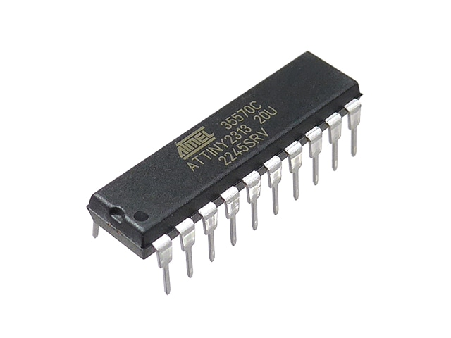
（秋月電子の販売ページより）

写真を見ると分かるように、マイコンにはピンがたくさんあります。小さいですが、CPUやメモリなどが全部入ってます。それだけでなくAD変換器やシリアル通信機能なども組み込まれてます。

## 2. 回路の準備

Meister新歓2024で使用する回路の情報はGithubで管理されています。詳細は[https://github.com/TitechMeister/Device-ATtiny2313_Board](https://github.com/TitechMeister/Device-ATtiny2313_Board)で確認できます。

### 2.1.部品リスト

|名称|個数|画像|
|:-:|:-:|:-:|
|ATtiny2313|1||
|1kΩ抵抗|14|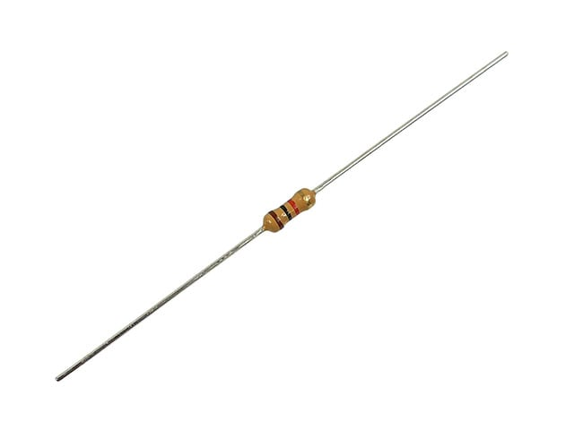|
|2SA1015L|4|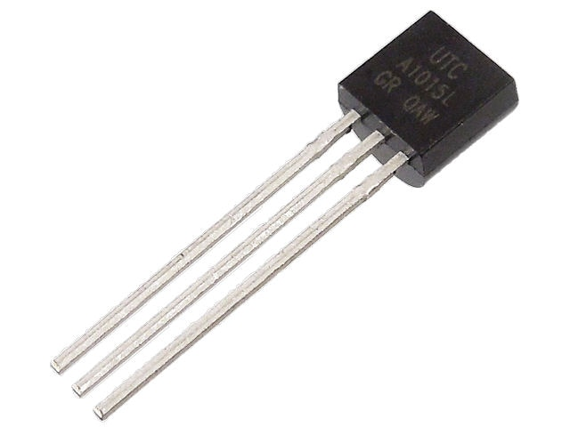|
|1x3ピンヘッダ|2|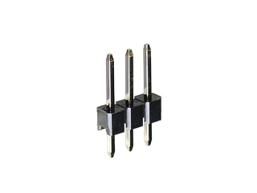|
|1x6ピンソケット|1|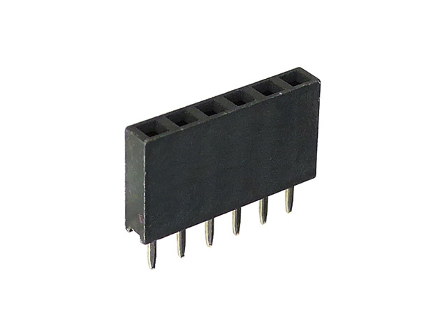|
|セラミックコンデンサ|1|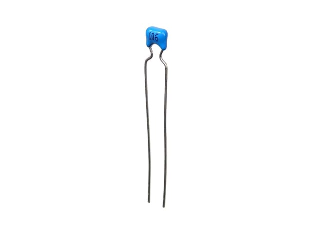|
|LED|1|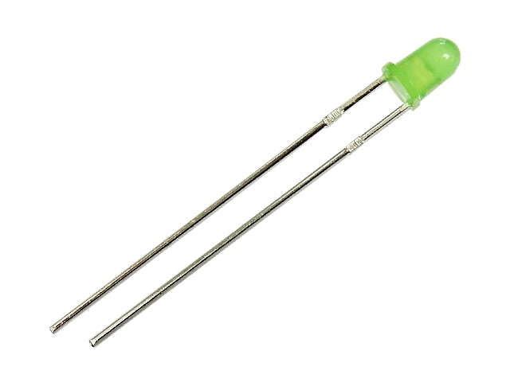|
|タクトスイッチ|1|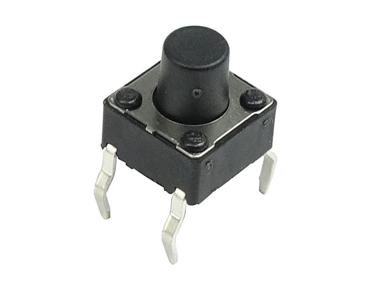|
|OSL40562 LR|1|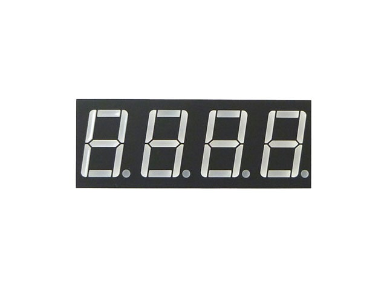|

(画像は全て秋月電子販売ページより)

## 3. はんだ付け

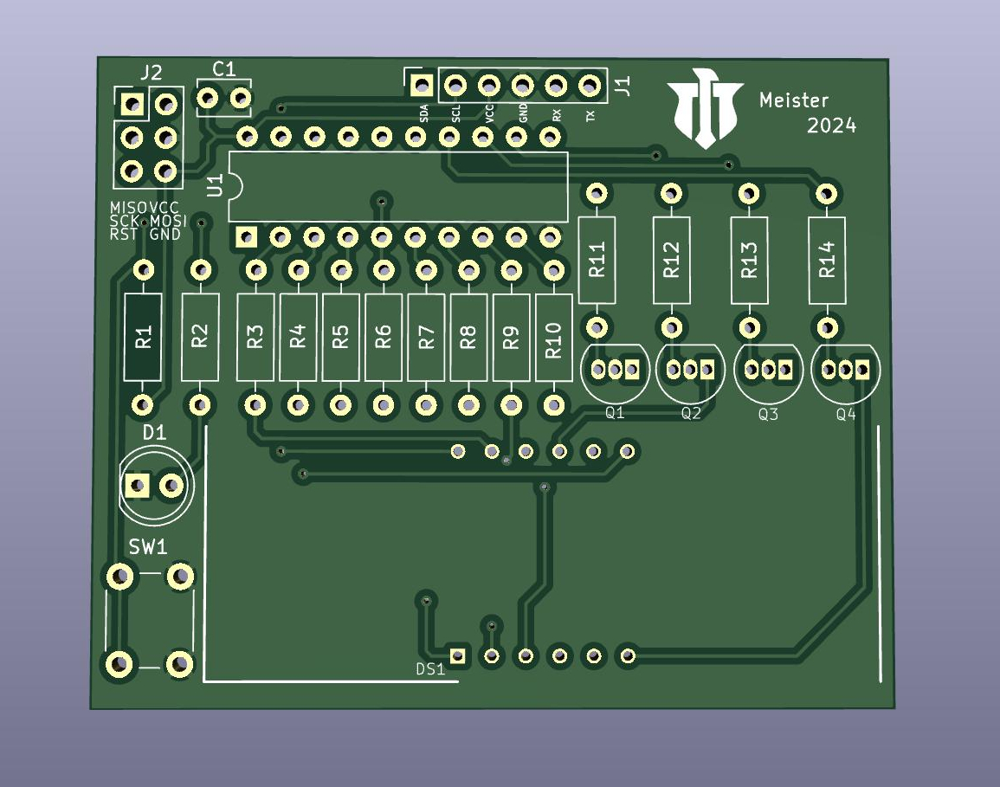
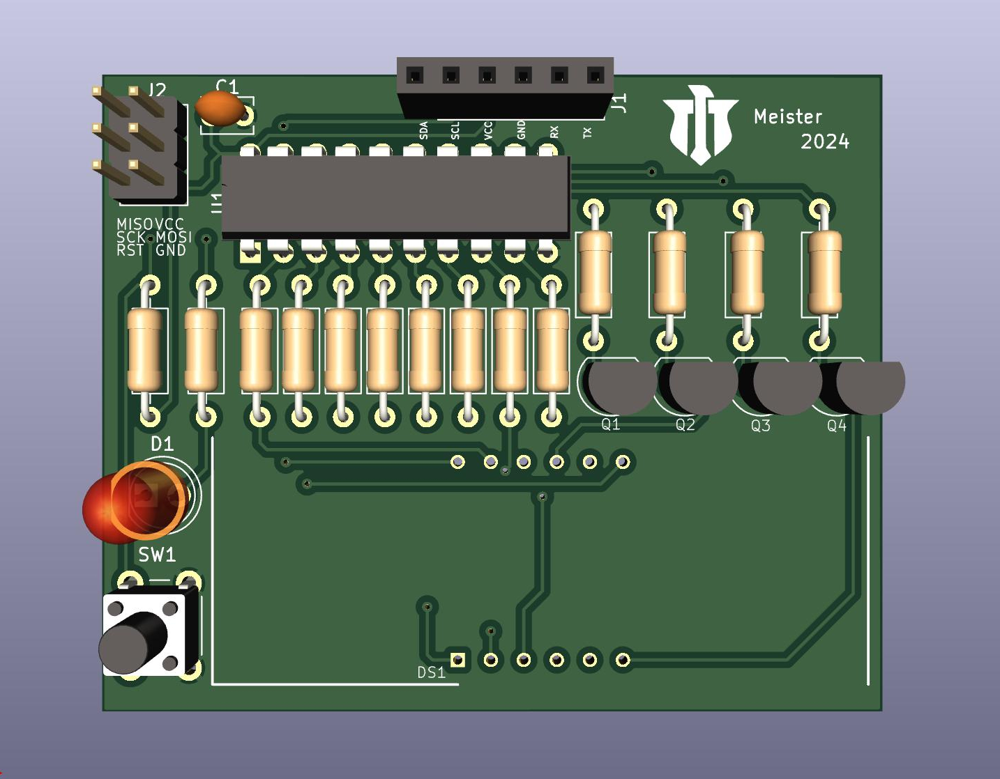

今回使う回路を上から見た図です。(部品なしと部品あり）

はんだ付けする際注意が必要な部分は以下の5点です。

1. マイコンを取り付ける位置。くぼみの部分を合わせます。
1. ７セグの向き。小数点を表示するためのLEDが端に来るように配置します。（上の画像に表示されてなくてすみません...その場で教えます👍)
1. トランジスタの向き。基板に印刷されている形に合わせてください。
1. LEDの向き。足の長い方を右側(基板の内側)にしてください。
1. タクトスイッチの向き。長方形なので間違えないと思いますが、間違えると他の部品が壊れちゃうので注意してください。

上手なはんだ付けをするために、以下の動画を参考にしてみてください。

部品と基板に書いてある番号との対応表です。

|番号|名称|個数|画像|
|:-:|:-:|:-:|:-:|
|U1|ATtiny2313|1||
|R1~R14|1kΩ抵抗|14||
|Q1~Q4|2SA1015L|4||
|J2|1x3ピンヘッダ|2||
|J1|1x6ピンソケット|1||
|C1|セラミックコンデンサ|1||
|D1|LED|1||
|SW1|タクトスイッチ|1||
|DS1|OSL40562 LR|1||

---

[次回](https://github.com/TitechMeister/Device-ATtiny2313_Board/tree/main/docs/day0.5/)に続きます。
