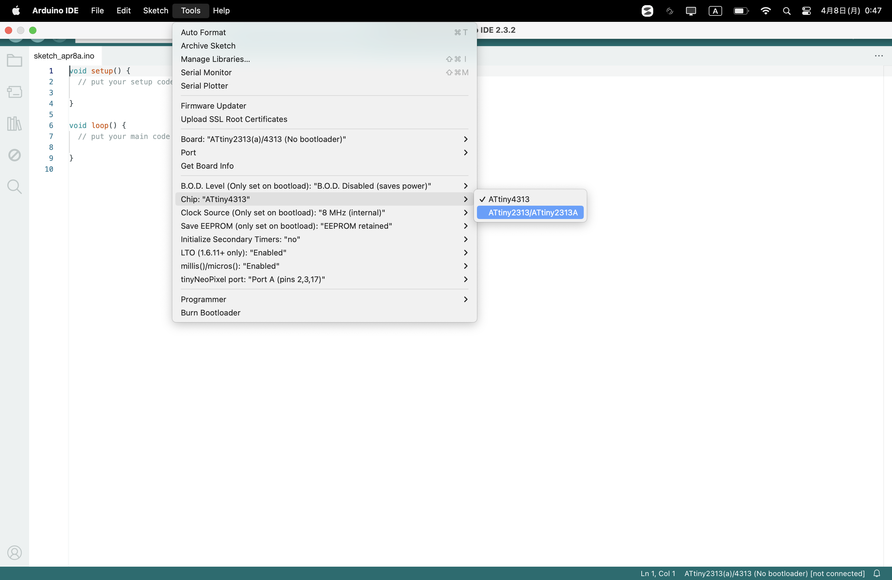

[前回](https://github.com/TitechMeister/Device-ATtiny2313_Board/tree/main/docs/day0)の続きです。

---

# 目次

* [はじめに(ハードウェア編)](https://github.com/TitechMeister/Device-ATtiny2313_Board/tree/main/docs/day0.0)
* はじめに(ソフトウェア編)<=今ココ
* [第1回 LEDとボタン](https://github.com/TitechMeister/Device-ATtiny2313_Board/tree/main/docs/day1/)
* [第2回 7セグメントLED](https://github.com/TitechMeister/Device-ATtiny2313_Board/tree/main/docs/day2/)
* [第3回 ダイナミック点灯](https://github.com/TitechMeister/Device-ATtiny2313_Board/tree/main/docs/day3/)
* [第4回 タイマ割り込み](https://github.com/TitechMeister/Device-ATtiny2313_Board/tree/main/docs/day4/)
* [第5回 スロットマシン](https://github.com/TitechMeister/Device-ATtiny2313_Board/tree/main/docs/day5/)

---

## 4. 開発環境の構築

### 4.1. Arduinoをインストール

[https://www.arduino.cc/en/software](https://www.arduino.cc/en/software) からArduino IDEをダウンロード&インストールしてください。

### 4.2. Board Managerを管理する

Arduino IDEを開いてPreferencesを開いてください。どこにあるかわからなかったら聞いてください。以下のような画面になると思います。


写真のように、`Additional board manager URLs:`の横のボタンを押してください。次のような画面が開くと思います。


青く色付けたように、```http://drazzy.com/package_drazzy.com_index.json```を追加してください。
終わったら`OK`を押します。


次に右のボードのアイコンをクリックしてみましょう。上のようなものが出るはずです。`BOARD MANAGER`の欄に`ATTinyCore`と入力すると画像のように表示されるでしょう。


このAttinyCoreを`install`してください。

### 4.3. コンパイラ、ライターの設定

まず、Tools > Board > ATTinyCore > ATtiny2313(a)/4313 と選択していってください。


次に、画像のように、Tools > Chip > ATtiny2313/ATtiny2313A　を選びます。



最後に、 Tools > Programmer > Arduino as ISP と選択してください。


以上で環境構築は終わりです。[次回](https://github.com/TitechMeister/Device-ATtiny2313_Board/tree/main/docs/day1/)からマイコンを動かしていきます。

---

## （参考）使うマイコンICについて

2024年のMeisterの作業体験ではATtiny2313というマイコンICを使います。~~めっちゃ古くて倉庫で眠っていたやつです~~

データシート：[https://ww1.microchip.com/downloads/en/DeviceDoc/Atmel-2543-AVR-ATtiny2313_Datasheet.pdf](https://ww1.microchip.com/downloads/en/DeviceDoc/Atmel-2543-AVR-ATtiny2313_Datasheet.pdf)

新しいシリーズがたくさん出ているので、自分でもやってみたい方はそちらの購入をお勧めします。
