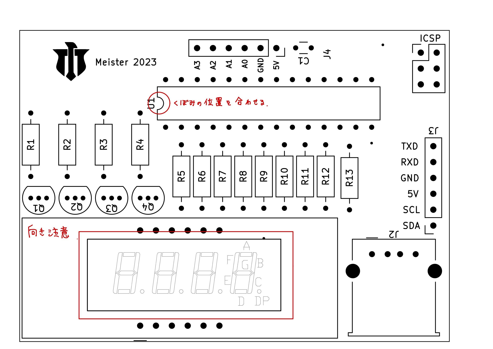

# 目次

* [はじめに(ハードウェア編)](https://github.com/TitechMeister/Device-ATmega88_Board/tree/main/docs/day0/)
* [はじめに(ソフトウェア編)](https://github.com/TitechMeister/Device-ATmega88_Board/tree/main/docs/day0.5/)
* [第1回 レジスタとLチカ](https://github.com/TitechMeister/Device-ATmega88_Board/tree/main/docs/day1/)
* [第2回 7セグメントLED](https://github.com/TitechMeister/Device-ATmega88_Board/tree/main/docs/day2/)
* [第3回 ダイナミック点灯](https://github.com/TitechMeister/Device-ATmega88_Board/tree/main/docs/day3/)
* [第4回 タイマ割り込み](https://github.com/TitechMeister/Device-ATmega88_Board/tree/main/docs/day4/)
* [第5回 サーミスタとAD変換](https://github.com/TitechMeister/Device-ATmega88_Board/tree/main/docs/day5/)

---

## 1. AVRとは

今回使うマイコンはAVRというものです。Arduino UNOに使われているマイコンもAVRです。

（秋月電子の販売ページより）

写真を見ると分かるように、マイコンにはピンがたくさんあります。小さいですが、CPUやメモリなどが全部入ってます。それだけでなくAD変換器やUARTなども組み込まれてます。

## 2. 回路の準備

Meister新歓2023で使用する回路の情報はGithubで管理されています。詳細は[https://github.com/TitechMeister/Device-ATmega88_Board](https://github.com/TitechMeister/Device-ATmega88_Board)で確認できます。

受け取る際には、事前に公式TwitteかDiscord、公式LINEで連絡をして頂けると幸いです。

### 2.1.部品リスト

|名称|個数|画像|
|:-:|:-:|:-:|
|ATmega88|1|</img>|
|1kΩ抵抗|14|</img>|
|2SC1815|4|</img>|
|1x3ピンヘッダ|2|</img>|
|1x6ピンヘッダ|2|</img>|
|USB typeA メス|1|</img>|
|OSL40562 LR|1|</img>|
|サーミスタ|1|</img>|
## 3. はんだ付け

今回使う回路を表から見た図です。

はんだ付けする際注意が必要な部分は以下の２点です。

1. マイコンを取り付ける位置。くぼみの部分を合わせます。
1. ７セグの向き。小数点を表示するためのLEDが端に来るように配置します。ロゴと７セグの向きは同じ向きです。

上手なはんだ付けをするために、以下の動画を参考にしてみてください。

部品と表に書いてある番号との対応表です。

|番号|名称|個数|画像|
|:-:|:-:|:-:|:-:|
|U1|ATmega88|1|</img>|
|R1~R12|1kΩ抵抗|14|</img>|
|Q1~Q4|2SC1815|4|</img>|
|ICSP|1x3ピンヘッダ|2|</img>|
|J3,J4|1x6ピンヘッダ|2|</img>|
|J2|USB typeA メス|1|</img>|
|J1|OSL40562 LR|1|</img>|
|はんだ付けしません|サーミスタ|1|</img>|

---

[次回](https://github.com/TitechMeister/Device-ATmega88_Board/tree/main/docs/day0.5/)に続きます。