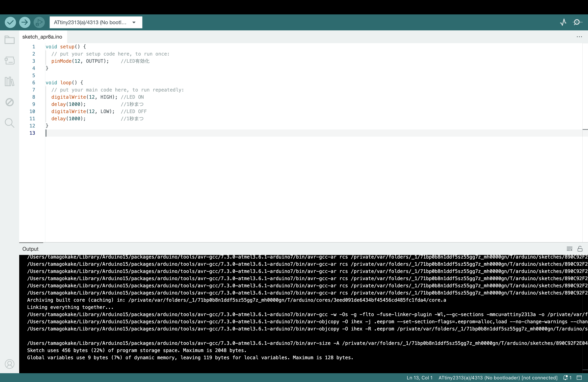
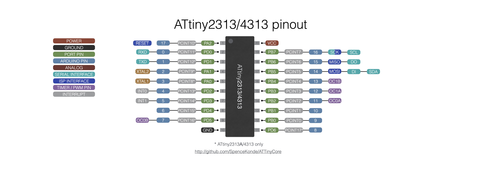
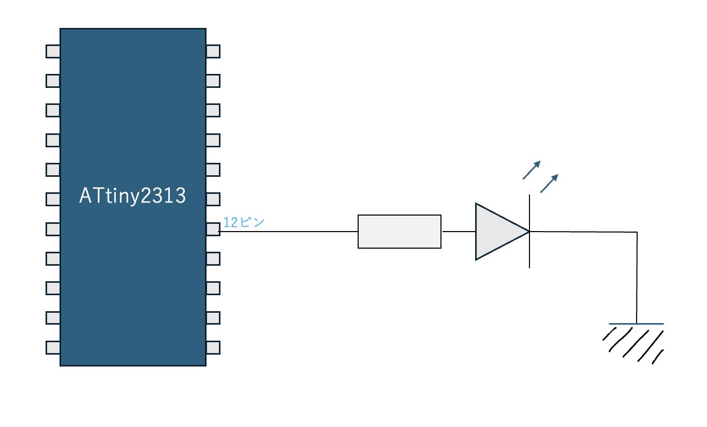
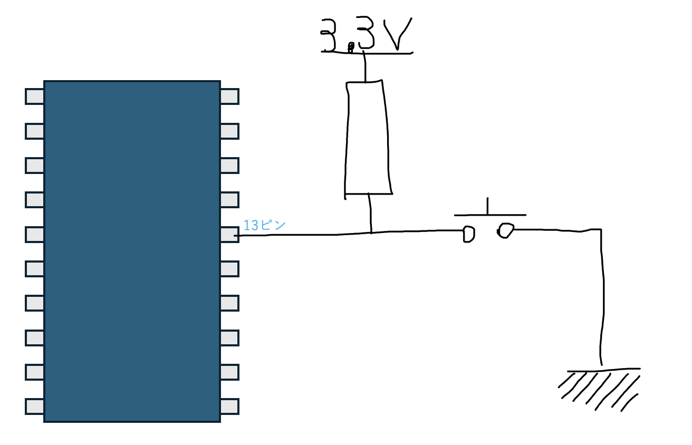

[ハードウェア編](https://github.com/TitechMeister/Device-ATtiny2313_Board/tree/main/docs/day0.0)と[ソフトウェア編](https://github.com/TitechMeister/Device-ATtiny2313_Board/tree/main/docs/day0.5)の準備が終わったところで、実際に基板を動かしていきましょう。まずはLEDを点滅させてみます。

---

# 目次

* [はじめに(ハードウェア編)](https://github.com/TitechMeister/Device-ATtiny2313_Board/tree/main/docs/day0.0)
* [はじめに(ソフトウェア編)](https://github.com/TitechMeister/Device-ATtiny2313_Board/tree/main/docs/day0.5)
* 第1回 LEDとボタン<=今ココ
* [第2回 7セグメントLED](https://github.com/TitechMeister/Device-ATtiny2313_Board/tree/main/docs/day2/)
* [第3回 ダイナミック点灯](https://github.com/TitechMeister/Device-ATtiny2313_Board/tree/main/docs/day3/)
* [第4回 タイマ割り込み](https://github.com/TitechMeister/Device-ATtiny2313_Board/tree/main/docs/day4/)
* [第5回 スロットマシン](https://github.com/TitechMeister/Device-ATtiny2313_Board/tree/main/docs/day5/)

---

## 5. プログラミング言語について

AVRはアセンブリ言語かC/C++言語で開発できます。今回はC/C++言語を使っていきます。厳密には、Arduino言語と呼ばれる、C/C++をわかりやすく改変した言語を使っていきます。

C言語の勉強については、[苦しんで覚えるC言語](https://9cguide.appspot.com/)を読むと必要な知識が学べます。ある程度読んでおいてもらえると助かりますが、読んでなくても（多分）大丈夫です。

## 6. プログラム

では実際に、プログラムを書いてみましょう。まずは以下のコードをコピーしてみてください。

```cpp
void setup() {
  // put your setup code here, to run once:
  pinMode(12, OUTPUT);    //LED有効化
}

void loop() {
  // put your main code here, to run repeatedly:
  digitalWrite(12, HIGH); //LED ON
  delay(1000);            //1秒まつ
  digitalWrite(12, LOW);  //LED OFF
  delay(1000);            //1秒まつ
}
```

## 7. プログラムを書き込む

このパソコン上のプログラムをマイコンに書き込みます。

### 7.1 AVRライター

マイコンにプログラムを書き込むには、「ライター」と呼ばれる専用の道具が必要です。今回は、Arduino Unoをライターとして使っていきます。使い方は、Arduino UnoのICSPと書いてある端子と基板上のICSPと書かれている端子６組を繋げば良いです。

## <span style='color:red'>ここで注意!!!!!!!</span>

今回用意した基板なんですが、発注時にちょっと間違えてしまい、**基板側のICSP端子の順番が一般的なICSP端子と異なります。** 間違えて繋げてしまうと故障の原因になるので、以下の図の繋ぎ方を**絶対**守ってください。**インターネット上の情報と異なる**ので注意してください。

~~間違えたらマイコンがめっちゃ発熱します~~

### 7.2 Arduino IDEでの書き込み

配線ができたら、Arduino IDEを立ち上げて、作ったプログラムを書きます。



ライターとPCをUSBで繋げます。Ctrl+Shift+Uと押せば書き込むことができます。

Done uploadingと表示され、実際にLEDが点滅したら、成功です👍

## 8. ピンについて

今回使うマイコンICのATtiny2313には足がたくさんあり、この足をピンといいます。ピンにはそれぞれ役割が与えられていて、プログラムで役割を切り替えることになります。また、図のようにそれぞれのピンには名前が割り当てられています。(一番内側のものが公式な名前)



各ピンに他にもいろいろなことが書いてありますが、これは役割の名前です。といっても今回はほとんど使わないので気にしないでください。<span style='color:#527fa8'>Arduino PIN</span>と書いてある、内側から３番目にある青色の0~17の数字のみを今回は使います。

## 9. プログラムの解説（Lチカ）

先ほど書いたプログラムがどういったものなのか、一つずつみていきましょう。

まず、大枠として

```cpp
void setup() {

}
void loop() {

}
```

という構造がありますね。これはそれぞれ、「起動して最初に一度だけ実行するプログラム」を書く部分と、「起動した後実行し続けるプログラム」を書く部分になっています。setup内で初期設定を、loop内で実際の動き（今回はLEDの点滅）を書くと良いです。

では、setupの詳しい中身を見ていきましょう。

```cpp
void setup() {
  // put your setup code here, to run once:
  pinMode(12, OUTPUT);    //LED有効化
}
```

`//`の後に続いている文章はコメントと呼ばれるもので、プログラムには影響しないので気にしないでください。
setup内のプログラムは一行だけ、`pinMode(12, OUTPUT);`というものがあります。これは、先ほど説明したATtiny2313のピンのうち、<span style='color:#527fa8'>Arduino PIN</span>でいう<span style='color:#527fa8'>12ピン</span>を出力機能として有効化する、という命令になります。今回の基板ではATtiny2313の<span style='color:#527fa8'>12ピン</span>をLEDに繋げているので、LED用の出力がこれでできるようになりました。

続いて、loopの中身を見ていきましょう。

```cpp
void loop() {
  // put your main code here, to run repeatedly:
  digitalWrite(12, HIGH); //LED ON
  delay(1000);            //1秒まつ
  digitalWrite(12, LOW);  //LED OFF
  delay(1000);            //1秒まつ
}
```

コメントからなんとなく想像できると思いますが、一つずつ見ていきましょう。
`digitalWrite(12, HIGH);`では、<span style='color:#527fa8'>12ピン</span>をHIGH、すなわち3.3Vに設定しています。LEDとマイコンは以下の図のように繋がっているので、12ピンをHIGHに設定すると電位差により電流が流れ、LEDが光ります。



`delay(1000);`は、プログラムの実行を1000ミリ秒=1秒停止します。これを入れないと、プログラムが高速で動くので人間の目では点滅を知覚できません。
`digitalWrite(12, LOW);`では、<span style='color:#527fa8'>12ピン</span>をLOW、すなわち0Vに設定します。<span style='color:#527fa8'>12ピン</span>を0Vに設定すると、上の図からも分かるように電位差がなくなって電流が流れなくなり、LEDが消えます。

## 10. ボタン入力

続いて、上のプログラムを少し改変した以下のプログラムを書き込んでみましょう。

```cpp
void setup() {
  // put your setup code here, to run once:
  pinMode(12, OUTPUT);    //LED有効化
  pinMode(13, INPUT);     //switch有効化
}

void loop() {
  // put your main code here, to run repeatedly:
  bool button = digitalRead(13); //buttonの値を保存
  if (button) {                  //もしbuttonが押されてたら...
    digitalWrite(12, HIGH);      //LEDをON
  }
  else {                         //そうでなければ...
    digitalWrite(12, LOW);       //LEDをOFF
  }
}
```

このプログラムを書き込むと、「ボタンを押してる間だけLEDが光る」ようになると思います。

## 11. プログラムの解説（ボタン入力）

上のLチカのプログラムからの変更点について、解説します。

setup内には、`pinMode(13, INPUT);`という一文が追加されています。これは、<span style='color:#527fa8'>13ピン</span>を入力ピンとして有効化するという命令です。

loop内は、まず`bool button = digitalRead(13);`という一文が追加されていますね。これは、bool型の`button`という変数に13番ピンの入力内容を代入する、といった意味です。このプログラムが実行されたときに<span style='color:#527fa8'>13ピン</span>がHIGH(3.3V)に接続されていればbuttonには1が、LOW(0V)に設定されていればbuttonには0が代入されます。
ちなみに、<span style='color:#527fa8'>13ピン</span>は以下のように繋がっています。



pullup抵抗と呼ばれる構造になっていて、ボタンを押していないときは3.3Vに、押している間は0Vに繋がります。

プログラムに戻ります。続きは次のようになっています。

```cpp
if (button) {                  //もしbuttonが押されてたら...
  digitalWrite(12, HIGH);      //LEDをON
}
else {                         //そうでなければ...
  digitalWrite(12, LOW);       //LEDをOFF
}
```

digitalWrite()は上のプログラムでもあったので省略します。
if-else文について軽く説明します。

```cpp
if () {
    ~~[program 1]~~
}
else {
    ~~[program 2]~~
}
```

 if-else文は、ifの後ろの()の中身が1の時にprogram1が、それ以外の時にはprogram2が実行される構文です。いま、変数buttonはボタンが押されている時に1,押されていない時に0になるように設定しているので、押されている時には`[program 1]`すなわち`digitalWrite(12, HIGH);`が、押されていない時には`[program 2]`すなわち`digitalWrite(12, LOW);`が動きます。

 これにより、ボタンを押しているか否かを検知してLEDを光らせることができました。

---

以上で第一回は終わりです。プログラムの書き込みと、ピンの入出力について理解してもらえたでしょうか。[次回](https://github.com/TitechMeister/Device-ATtiny2313_Board/tree/main/docs/day2/)は7セグメントLEDを使います。
