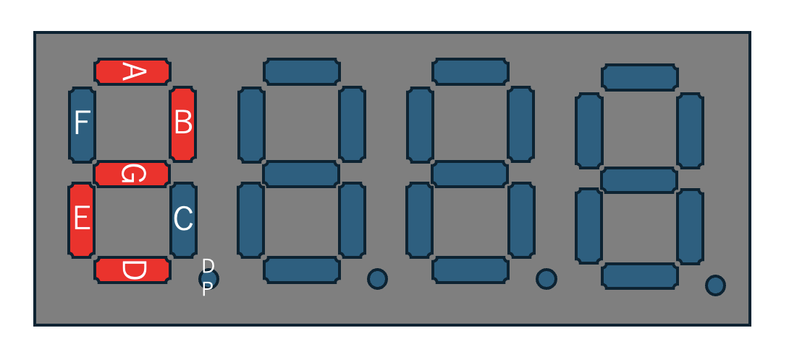

[前回](https://github.com/TitechMeister/Device-ATmega88_Board/tree/main/docs/day1/)の続きです。今回は７セグで数字を表示します。

---

# 目次

* [第0回 はじめに(ハードウェア編)](https://github.com/TitechMeister/Device-ATmega88_Board/tree/main/docs/day0/)
* [第0回 はじめに(ソフトウェア編)](https://github.com/TitechMeister/Device-ATmega88_Board/tree/main/docs/day0.5/)
* [第1回 Lチカ](https://github.com/TitechMeister/Device-ATmega88_Board/tree/main/docs/day1/)
* 第2回 7セグメントLED　←ここ
* [第3回 ダイナミック点灯](https://github.com/TitechMeister/Device-ATmega88_Board/tree/main/docs/day3/)
* [第4回 タイマ割り込み](https://github.com/TitechMeister/Device-ATmega88_Board/tree/main/docs/day4/)
* [第5回 サーミスタとAD変換](https://github.com/TitechMeister/Device-ATmega88_Board/tree/main/docs/day5/)

---

## 12. 7セグメントLEDとは

まず、今回扱う７セグメントLEDについて説明します。


７セグメントLEDとは上の画像のようなLEDを使った表示器のことをいいます。７個のLEDを使い一桁の数字を表すことから、その名前がつきました。

下の図のように、それぞれの辺ごとにLEDが配置されています。例えば、「7」と表示したければ、AとBとCとFのLEDを点灯すれば良いわけです。

</img>

７セグでは、それぞれの桁で、LEDのカソード側（-側）もしくはアノード(+側)が一緒になっています。カソード側が一緒になったものを**カソードコモン**、アノード側が一緒になったものを**アノードコモン**といいます。今回はカソードコモンを使います。


7セグの大体の回路図です。トランジスタや７セグの内部構造などが少し難しいと思うのでプログラム上での使い方だけ説明します。

まず、それぞれのつながっているピンを方にすると次の通りです。

|ATtiny2313(Arduino PIN)|7セグ|
|:-:|:-:|
|0|A|
|1|B|
|2|C|
|3|D|
|4|E|
|5|F|
|6|G|
|7|DP|
|8|(1digit)*|
|9|(2digit)*|
|10|(3digit)*|
|11|(4digit)*|

\*1digit~4digitは、正確にはトランジスタのベースに繋がっています。

プログラムでそれぞれのピンを次のように設定すると光ります。

* A\~G,DPに繋がっているピンは、**HIGH**にすると７セグの対応する箇所が**光り**、**LOW**にすると**消えます**。
* (1digit)\*~(4digit)\*に繋がっているピンは、**LOW**にすると対応する桁が**有効化**され、**HIGH**にすると**無効化**されます。
  
つまり有効化され、かつ対応するA~G,DPのピンがHIGHになった場合にのみ光ります。例えば、一番左の桁に2を表示させたかったら、次のようにそれぞれのピンを出力します。

|ATtiny2313(Arduino PIN)|7セグ|HIGH/LOW|
|:-:|:-:|:-:|
|0|A|HIGH|
|1|B|HIGH|
|2|C|LOW|
|3|D|HIGH|
|4|E|HIGH|
|5|F|LOW|
|6|G|HIGH|
|7|DP|LOW|
|8|(1digit)*|LOW|
|9|(2digit)*|HIGH|
|10|(3digit)*|HIGH|
|11|(4digit)*|HIGH|



疑問に思った方もいるかもしれませんが、複数の桁に別の数字を表示する方法については、次回扱います。

## 13. プログラム

[前回](https://github.com/TitechMeister/Device-ATmega88_Board/tree/main/docs/day1/)と14.の内容を参考にして、 **0~9までを1秒ごとに繰り返しカウントアップするプログラム** を書いてみましょう。何桁目に表示するかは任せます。

### 13.1. ヒント

* まず、使いたいピンを出力モードにするのを忘れないようにしましょう。
* １秒停止する方法、ピンの出力を変更する方法は覚えていますか？

* １秒ごとに繰り返しカウントアップさせるには、現在何カウント目なのか、保存しておく必要がありますね。値を保存するには、変数に格納するのが良いでしょう。

* (応用)A\~Gのピンの出力を、0\~9の数字それぞれに対して場合分けして書くのは面倒ですね。配列やループなどを使って短くしてみましょう。

### 13.2. プログラム例

<details>

```cpp
int count = 0;                                   //カウントアップ用の変数

unsigned char num[10] = {0b11111100, 0b01100000, //0b~~~~~~~~は数字の二進数表示を表す。
                        0b11011010, 0b11110010,
                        0b01100110, 0b10110110,
                        0b10111110, 0b11100000,
                        0b11111110, 0b11110110}; //7セグの各数字のパーツごとのHIGH/LOW。順にABCDEFG(DP)

unsigned char mask[8] = {0b10000000, 0b01000000,
                        0b00100000, 0b00010000,
                        0b00010000, 0b00000100,
                        0b00000010, 0b00000001}; //マスクビット

void setup() {
  // put your setup code here, to run once:
  for (int i = 0; i < 9; i++) {
    pinMode(i, OUTPUT);   //0~8ピンの出力機能を有効化、すなわちA~DP, digit1に出力できるように
  }
  digitalWrite(8, LOW);   //digit1を有効化

}

void loop() {
  // put your main code here, to run repeatedly:
  for (int i = 0; i < 8; i++) {
    unsigned char LED = num[count] & mask[i]; //countの数字のLED表示について、上i桁目のHIGH/LOWを考える
    if (LED == 0) {                          //上i桁目が0ならば、マスクビットとのAND演算によってLEDは0b00000000になっている
      digitalWrite(i, LOW);                  //よってi番目のピンをLOWに設定
    }
    else {                                   //そうでなければ、上i桁目は1
      digitalWrite(i, HIGH);                 //よってi番目のピンをHIGHに設定
    }
  }

  count = count + 1; //カウントアップ
  if (count >= 10) { //カウントアップしすぎた場合は0に戻す
    count = 0;
  }
  delay(1000);       //1秒まつ

}

```

</details>

### 13.3. プログラムの解説

全体の概要としては、

1. 必要な変数たちを最初に定義しておく
2. setupでピンの出力機能を有効化したりする
3. 現在のカウント数に応じて、７セグの対応する箇所を一つずつ光らせて（消して）いく
4. カウントアップして１秒まつ
5. 3に戻ってループ

といった流れになっています。随所に新しい考え方が使われているので一つずつ解説していきます。

* `int count = 0;`や`unsigned char num[10] = { ... };`といった変数はsetupやloopの外側に宣言されています。これには二つの理由があります。一つ目は、setup内に書くとloop内からアクセスできないからです。二つ目は、loop内に書くと毎回0になってしまい、一向にカウントアップされないからです。これらの理由から、count変数はsetupからもloopからも外れた場所に宣言しています。~~numの方は正直loop内でも良い~~

* 上にも出てきましたが、`num[10] = { ... }; mask[8] = { ... };`といった変数があります。これは**配列**と言って、同じような変数をまとめることができる優れものです。uriage1/1 = 100, uriage1/2 = 150, uriage1/3 = 120 ...といちいち変数を決めていたら大変ですよね。uriage1gatsu[31] = {100, 150, 120 ... }と書けば、はるかに短く書くことができます。詳しい書き方や使い方は、ネットにわかりやすい記事がゴロゴロ転がっているので調べてみてください。（別に不親切とかじゃなく、純粋に私が書いたものより分かりやすいと思うので...）

* for文についても同様に、分からない方は調べてみてください。

また今回は、ビットマスクという考え方を使っています。ビットマスクとは、「二進数データのうち、見たい桁だけを取り出す」ための過程のことを言います。AND演算と呼ばれる計算を行うことで実装することができます。

例えば、「国語が得意か」「数学が得意か」「英語が得意か」という三つの質問に対して、YesNoで答えてもらったデータがあるとします。(数学のみ得意なら010,全科目得意なら111)
このデータを使って「数学が得意かどうか」のみを調べたいとします。しかし現在のままでは、「国語も数学も得意な人(110)」「英語も数学も得意な人(011)」など、余分な情報が混ざっていて、区別が煩雑になっています。
数学が得意かどうかのみを知りたいので、2桁目の値だけを取り出したいですね。**各桁ごとに計算することができる**としたら、**不必要な桁には0をかける**ことで、余分な情報を取り除くことができます。(110(国数) & 010 => 010(数), 101(国英) & 010 => 000(~~数弱~~))
この計算がAND演算子によって簡単に実装できるので、コンピュータの世界ではよく使われる方法になっています。

以下の部分でビットマスクが使われています。

```cpp
  for (int i = 0; i < 8; i++) {
    unsigned char LED = num[count] & mask[i]; //countの数字のLED表示について、上i桁目のHIGH/LOWを考える
    if (LED == 0) {                          //上i桁目が0ならば、マスクビットとのAND演算によってLEDは0b00000000になっている
      digitalWrite(i, LOW);                  //よってi番目のピンをLOWに設定
    }
    else {                                   //そうでなければ、上i桁目は1
      digitalWrite(i, HIGH);                 //よってi番目のピンをHIGHに設定
    }
  }
```

num配列の各要素は、それぞれの数字がどのLEDを光らせることで表現できるかを表しています。上1桁目が1ならばAを光らせ、2桁目が0ならばBは消して...と言ったふうにすれば、数字を光らせることができるはずです。表現する数字は配列のインデックスと対応しています。
ビットマスクによって、i桁目が0かどうかを簡単に判別することができています。あとは対応するピンをHIGHやLOWに出力すれば良いです。この基板ではたまたま、出力するピン番号と桁が同じなのでi番ピンの出力を設定します。

上手く動いたでしょうか。分からないことがあったら気軽に聞いてください！

---

今回はこれで終了です。[次回](https://github.com/TitechMeister/Device-ATmega88_Board/tree/main/docs/day3)は4桁全てを点灯させてみます。
