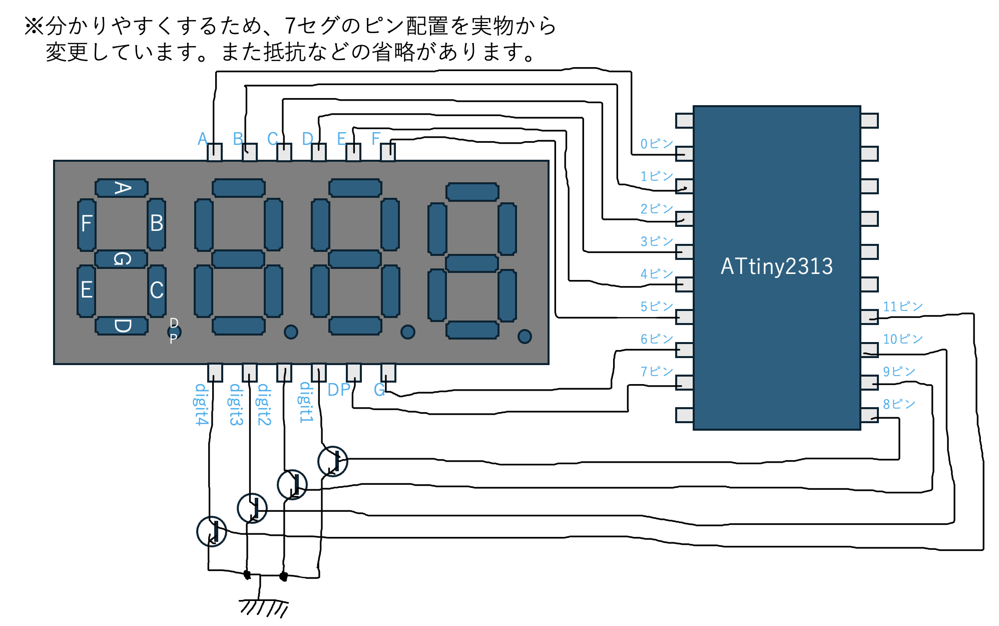

[前回](https://github.com/TitechMeister/Device-ATtiny2313_Board/tree/main/docs/day2/)の続きです。今回は７セグで4桁の数字を表示します。

---

# 目次

* [はじめに(ハードウェア編)](https://github.com/TitechMeister/Device-ATtiny2313_Board/tree/main/docs/day0.0)
* [はじめに(ソフトウェア編)](https://github.com/TitechMeister/Device-ATtiny2313_Board/tree/main/docs/day0.5)
* [第1回 LEDとボタン](https://github.com/TitechMeister/Device-ATtiny2313_Board/tree/main/docs/day1/)
* [第2回 7セグメントLED](https://github.com/TitechMeister/Device-ATtiny2313_Board/tree/main/docs/day2/)
* 第3回 ダイナミック点灯<=今ココ
* [第4回 タイマ割り込み](https://github.com/TitechMeister/Device-ATtiny2313_Board/tree/main/docs/day4/)
* [第5回 スロットマシン](https://github.com/TitechMeister/Device-ATtiny2313_Board/tree/main/docs/day5/)

---

## 14. 前回のプログラムの問題点

[前回](https://github.com/TitechMeister/Device-ATtiny2313_Board/tree/main/docs/day2/)は7セグで一桁だけ表示させてみました。[前回](https://github.com/TitechMeister/Device-ATtiny2313_Board/tree/main/docs/day2/)の方法で2桁表示しようとすると、 $8\times 2=16$ 本のピンが7セグのために必要になります。4桁では32本のピンが必要になりますが、これはマイコンのピンの数を超えてしまいます。

## 15. ダイナミック点灯

7セグを制御するためのピンの数を減らす方法の一つに**ダイナミック点灯**というものがあります。これについて説明していきます。

1. 1桁目**だけ**を点灯します。この状態で5ms程度待ちます。
2. 2桁目**だけ**を点灯します。この状態で5ms程度待ちます。
3. 3桁目**だけ**を点灯します。この状態で5ms程度待ちます。
4. 4桁目**だけ**を点灯します。この状態で5ms程度待ちます。

1.~4.を繰り返し実行します。すると、各桁の残像が見えるため、4桁全てが点灯しているように見えます。

## 16. トランジスタ



これは、[前回](https://github.com/TitechMeister/Device-ATtiny2313_Board/tree/main/docs/day2/)のなんとなくの回路図です。[前回](https://github.com/TitechMeister/Device-ATtiny2313_Board/tree/main/docs/day2/)ではトランジスタの説明を省きましたが、今回は非常に重要な役目を果たしてくれるので説明します。

<span style='color:#527fa8'>8~11ピン</span>につながっているのは2SA1015Lというトランジスタです。トランジスタには２種類の役割があります。**増幅作用**と**スイッチング作用**です。

トランジスタには３本のピン（エミッタ、コレクタ、ベース）があります。**増幅作用**とは、ベースに少し電流を流すことで、エミッタとコレクタの間にたくさん電流を流す働きです。

**スイッチング作用**は電子回路上でスイッチの役割を果たすことです。電子的なHIGH/LOWによって素早くオンオフを切り替えることができます。

上の回路ではスイッチング作用を使っています。

<span style='color:#527fa8'>8~11ピン</span>のHIGH/LOWをいじれば、表示する桁を帰ることが出来ます。同時に複数桁表示することもできます。

## 17. プログラム

では、ダイナミック点灯の考え方を使って1秒ごとに9999からカウントダウンするプログラムを作ってみましょう。

### 17.1. ヒント

* 例えば、変数numを10進数で表したときの二桁目の数dは、1000で割った余りを100で割ったときの商です。つまり以下のようにすれば、10進数で2桁目の数を取り出せます。

```cpp
int d=(num%1000)/100;　// ex. (1467%1000)/100 == 4
```

* [前回](https://github.com/TitechMeister/Device-ATtiny2313_Board/tree/main/docs/day2/)作ったコードを上手く流用してみましょう。例えば、数字を表示するための配列は使いまわすことが出来そうです。

* delay()で指定した時間(ms)だけ待機することができます。
* (発展)「i桁目にnを表示する」というプログラムを何度も実行することになります。関数にしておくと、書きやすくなります。

### 17.2. プログラム例

<details>

```cpp
int count = 9999;                                   //カウントダウン用の変数

unsigned char num[10] = {0b11111100, 0b01100000, //0b~~~~~~~~は数字の二進数表示を表す。
                        0b11011010, 0b11110010,
                        0b01100110, 0b10110110,
                        0b10111110, 0b11100000,
                        0b11111110, 0b11110110}; //7セグの各数字のパーツごとのHIGH/LOW。順にABCDEFG(DP)

unsigned char mask[8] = {0b10000000, 0b01000000,
                        0b00100000, 0b00010000,
                        0b00001000, 0b00000100,
                        0b00000010, 0b00000001}; //マスクビット

void display(char digit, int dispnum) {  //digitは表示する桁(1~4), dispnumは表示する値(0~9)
  for (int i = 0; i < 8; i++) {
    unsigned char LED = num[dispnum] & mask[i]; //countの数字のLED表示について、上i桁目のHIGH/LOWを考える
    if (LED == 0) {                          //上i桁目が0ならば、マスクビットとのAND演算によってLEDは0b00000000になっている
      digitalWrite(i, LOW);                  //よってi番目のピンをLOWに設定
    }
    else {                                   //そうでなければ、上i桁目は1
      digitalWrite(i, HIGH);                 //よってi番目のピンをHIGHに設定
    }
  }

  for (int i = 8; i < 12; i++) { //何桁目を表示して何桁目を表示しないのか
    if (i == digit+7) {
      digitalWrite(digit+7, LOW); //digit1->8ピン, digit2->9ピン, digit3->10ピン, digit4->11ピンをLOW
    }
    else {
      digitalWrite(i, HIGH); //表示したい桁以外は無効化
    }

  }
}

void setup() {
  // put your setup code here, to run once:
  for (int i = 0; i < 12; i++) {
    pinMode(i, OUTPUT);   //0~11ピンの出力機能を有効化、すなわちA~DP, digit1~4に出力できるように
  }

}

void loop() {
  // put your main code here, to run repeatedly:
  for (int i = 0; i < 50; i++) {
    display(1, count/1000);        //上1桁目(1000の位)の表示
    delay(5);
    display(2, (count%1000)/100);  //上2桁目(100の位)の表示
    delay(5);
    display(3, (count%100)/10);    //上3桁目(10の位)の表示
    delay(5);
    display(4, count%10);          //上4桁目(1の位)の表示
    delay(5);
  }
  count = count - 1; //カウントダウン
  if (count == 0) { //カウントダウンしすぎた場合は9999に戻す
    count = 9999;
  }
}

```

</details>

### 17.3. プログラムの解説

前回からの変更点は、次のとおりです。

* displayの表示処理を関数化しました。関数については、例の如くインターネットで調べてください()
* countの初期値を9999にして、カウントアップからカウントダウンに変更しました。
* 出力ピンの数を増やしました。(0\~8 -> 0\~11)
* 「カウントアップして1秒まつ」処理だったのを、「5msごとの表示を4回x50セット繰り返したらカウントダウンする」処理にしました。

表示関係については大きく変更されているので、丁寧に解説します。

まず、display()関数についてですが、「第一引数に桁数を、第二引数に表示する値を入れるとその通りに表示してくれる」という中身になっています。
前半部分は[前回](https://github.com/TitechMeister/Device-ATmega88_Board/tree/main/docs/day2/)のプログラムとほとんど同じです。表示する値が`count`から第二引数の`dispnum`に変わっていることだけ注意してください。
大きく変わったのは後半部分です。前回はこんなものなかったですね。表示する桁を制御するために、<span style='color:#527fa8'>8~11ピン</span>のHIGH/LOWを上手く調節しています。表示したい桁ならばLOW、そうでなければHIGH、と言った具合です。

続いて、表示回数についても大きな違いがあります。前回は「１秒間表示し続ける」プログラムでしたが、今回はダイナミック点灯なので「5msごとに違う桁の値を表示する」プログラムになっています。違う桁では違う値を表示することになるので、桁ごとに表示する値を計算しているのも特徴です。

---

今回はここで終了です。[次回](https://github.com/TitechMeister/Device-ATtiny2313_Board/tree/main/docs/day4/)はタイマ割り込みをします。
