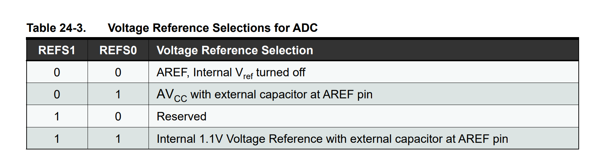
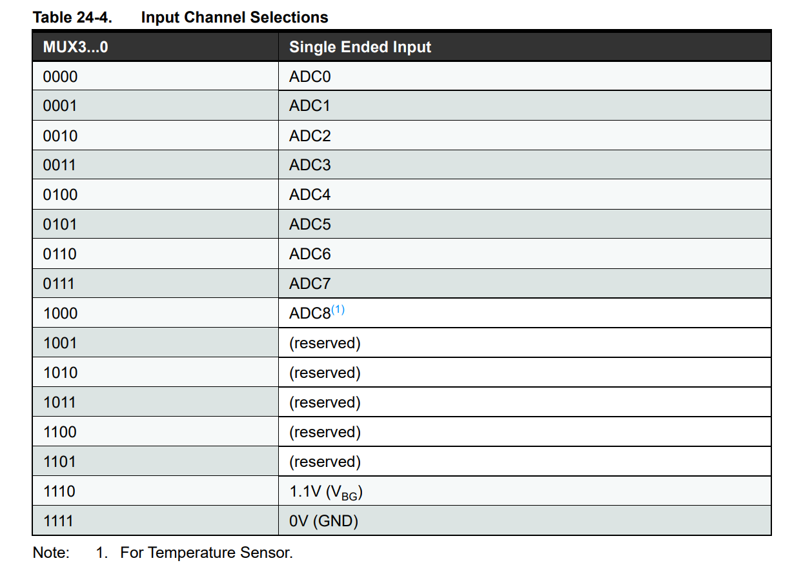
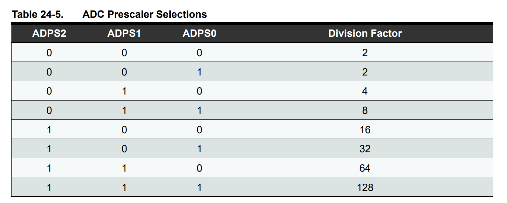

[前回](https://github.com/TitechMeister/Device-ATmega88_Board/tree/main/docs/day4/)の続きです。今回はついに温度計を作ります。


# 目次

* [はじめに(ハードウェア編)](https://github.com/TitechMeister/Device-ATmega88_Board/tree/main/docs/day0/)
* [はじめに(ソフトウェア編)](https://github.com/TitechMeister/Device-ATmega88_Board/tree/main/docs/day0.5/)
* [第1回 レジスタとLチカ](https://github.com/TitechMeister/Device-ATmega88_Board/tree/main/docs/day1/)
* [第2回 7セグメントLED](https://github.com/TitechMeister/Device-ATmega88_Board/tree/main/docs/day2/)
* [第3回 ダイナミック点灯](https://github.com/TitechMeister/Device-ATmega88_Board/tree/main/docs/day3/)
* [第4回 タイマ割り込み](https://github.com/TitechMeister/Device-ATmega88_Board/tree/main/docs/day4/)
* 第5回 サーミスタとAD変換　←ここ

---

## 24. AD変換

コンピューターは基本的には、デジタル（＝離散的）な値しか処理できません。
電圧などのアナログ（＝連続的）なデータを扱うためには**AD変換**をします。

AD変換では、基準電圧を数等分します。今回は0~5Vを1023等分します。AD変換器は、計測する電圧を等分した一番近い値に変換します。例えば、4Vであれば、819が最も近い値となります。この値を利用できるようになっています。

出力された値から電圧を計算したい場合は以下のように計算します。

$$
実際の電圧=\frac{出力された値}{1023}
$$

## 25. AVRマイコンのAD変換

AD変換で使うレジスタは`ADCSRA`,`ADMUX`,`ADLAR`,`ADLAR`の3つです。

### 25.1. ADC Multiplexer Selection Register

|ADMUX|7|6|5|4|3|2|1|0|
|:-:|:-:|:-:|:-:|:-:|:-:|:-:|:-:|:-:|
|ビット名|**REFS1**|**REFS2**|**ADLAR**|-|**MUX3**|**MUX2**|**MUX1**|**MUX0**|
|値|0|0|0|0|0|0|0|0|

AD変換の基準電圧はAREFの電圧です。ここの部分は以下のようにAVCCとマイコン内で生成された1.1Vと繋がっています。

これらのスイッチは`REFS1`と`REFS2`で基準電圧を選択します。  **今回はAVCCとAVREFが外部で接続されているため、`00`を入れます。**



AVRマイコンにはAD変換できるピンが６つありますが、6つAD変換器があるわけではありません。

以下の図のように、どのピンと接続するかを選ぶ必要があります。

`MUX0`から`MUX3`でどのピンに接続するかを選ぶことができます。**今回はADC0の電圧を測りたいので、`0000`を入れます。**



`ADLAR`はAD変換の結果をレジスタに代入するとき、左右のどちらに詰めるかを設定します。

### 25.2. ADC Control and Status Register A

|ADCSRA|7|6|5|4|3|2|1|0|
|:-:|:-:|:-:|:-:|:-:|:-:|:-:|:-:|:-:|
|ビット名|**ADEN**|**ADSC**|ADATE|ADIF|ADIE|**ADPS2**|**ADPS1**|**ADPS0**|
|値|1|0|0|0|0|1|0|0|

まず、ADENはAD変換を有効にするかを選択するビットです。1にすると有効になります。

`ADPS2`から`ADPS0`はタイマのときにもあったプリスケーラの設定です。あまり速すぎると10bit読み込む時間が無くなってしまいます。
目安として、50k~200kHzぐらいになるように設定します。**今回は16分周するので62.5kHzで読み取ります。**

**ADSCを1にすると、AD変換が始まります。** 終了するとADSCが0に戻ります。とりあえず、最初は0にしておきます。



### 25.3. The ADC Register

|ADC|F|E|D|C|B|A|9|8|7|6|5|4|3|2|1|0|
|:-:|:-:|:-:|:-:|:-:|:-:|:-:|:-:|:-:|:-:|:-:|:-:|:-:|:-:|:-:|:-:|:-:|
|ビット名|-|-|-|-|-|-|-|-|-|-|-|-|-|-|-|-|
|値|-|-|-|-|-|-|-|-|-|-|-|-|-|-|-|-|

AD変換の結果はADCに入れられます。

### 25.4. AD変換の結果を表示するプログラム

ここまでの話をまとめて、AD変換の結果を7セグに表示するプログラムを書いてみましょう。

```cpp
#include<avr/io.h>
#include<util/delay.h>
#include<avr/interrupt.h>

unsigned char buf[4];

void display(int i);

int main(void){
	DDRD=0xFF;
	PORTD=0b00000000;
	DDRB=0x0F;
	PORTB=0x00;

	//timer0 制御レジスタA
	TCCR0A = 0b00000010;
	//timer0 制御レジスタB
	TCCR0B = 0b00000101;
	//timer0 割り込み設定
	TIMSK0 = 0b00000010;
	OCR0A=4;

    // AD変換の設定
    ADMUX=0b00000000;
    ADCSRA=0b10000100;

    _delay_ms(5);//AD変換器の初期化

	//割り込みを許可
	sei();
	volatile int value=0;
	while(1){

		ADCSRA|=0b01000000; //AD変換スタート
        while(!(ADCSRA&0b01000000)){}//変換中...
        value=ADC;
	
        display(value);
	}
	return 0;
}

void display(int i){
	const unsigned char digit[]={0x3F,0x06,0x5B,0x4F,0x66,0x6D,0x7D,0x07,0x7F,0x6F};
	/*ピンの接続:
	 * PORTD:
	 * 	0 -> A		
	 * 	1 -> B		    A
	 * 	2 -> C		  +---+
	 * 	3 -> D		F | G |B
	 * 	4 -> E		  +---|
	 * 	5 -> F		E |   |C
	 * 	6 -> G		  +---+ .
	 * 	7 -> DP		    D   DP
	 * */
	i=i%10000;
	buf[3]=digit[i%10];
	buf[2]=digit[(i%100)/10];
	buf[1]=digit[(i%1000)/100];
	buf[0]=digit[i/1000];
}

ISR(TIMER0_COMPA_vect){
	static int sw=0;
	sw=(sw+1)%4;
	PORTB=1<<sw;
	PORTD=buf[sw];
}

```


## 26. サーミスタ

高校では、金属の抵抗値が温度の一次関数で表せることを習いました。
サーミスタは、以下の式で抵抗値が決まります。

$$
R=R_0 e^{B(T^{-1}-T_0^{-1})}
$$

ただし、温度 \$T_0$ (K)における抵抗値が \$R_0$ であるとします。また、**\$B$** をB定数といいます。

今回扱うサーミスタは \$T_0=25(^{\circ}C)$ で \$R_0=10(k\Omega)$ で \$B=3435(K)$ なので、抵抗値が \$R(k\Omega)$ のときの温度は、

$$
\begin{aligned}
T&=\frac{BT}{T_0\log(R/R_0)+B}\\
&=\frac{1020992.5}{298.1\log(R/10)+3425}
\end{aligned}
$$

となります。


## 27. プログラム

では、いよいよプログラムを書いていきましょう！

```cpp
#include <avr/io.h>
#include <util/delay.h>
#include <avr/interrupt.h>
#include <math.h>

unsigned char buf[4];

void display(double d);

int main(void) {
	DDRD = 0xFF;
	PORTD = 0b00000000;
	DDRB = 0x0F;
	PORTB = 0x00;

	ADCSRA=0b10000100;
	ADMUX=0b00000000;
	_delay_ms(5);

	//timer0 制御レジスタA
	TCCR0A = 0b00000010;
	//timer0 制御レジスタB
	TCCR0B = 0b00000101;
	//timer0 割り込み設定
	TIMSK0 = 0b00000010;
	OCR0A = 4;
    
    // AD変換の設定
    ADMUX=0b00000000;
    ADCSRA=0b10000100;
    _delay_ms(5);

	//割り込みを許可
	sei();
	int i = 5000;
    volatile double temp=0.0;
	while (1) {
        
		ADCSRA|=0b01000000; //AD変換スタート
        while(!(ADCSRA&0b01000000)){}//変換中...

		double adc=(double)ADC;

        temp=1020992.5/10.0/(298.1*log(adc/(1023.0-adc))+3425.0);//温度に変換

		display(temp);
		_delay_ms(100);
	}
	return 0;
}

void display(double f) {
	const unsigned char digit[] = { 0x3F, 0x06, 0x5B, 0x4F, 0x66, 0x6D, 0x7D, 0x07, 0x7F, 0x6F };
	/*ピンの接続:
	 * PORTD:
	 * 	0 -> A		
	 * 	1 -> B		    A
	 * 	2 -> C		  +---+
	 * 	3 -> D		F | G |B
	 * 	4 -> E		  +---|
	 * 	5 -> F		E |   |C
	 * 	6 -> G		  +---+ .
	 * 	7 -> DP		    D   DP
	 * */
	if(f>0){
		int d=(int)log10(f)+1; // 整数部分の桁数

		if(d<0|d>4){ //正の実数で表示可能なのは0.001~9999.9...の範囲
			return;
		}
		int i=(int)(f*(pow(10,4-d)));

		i = i % 10000;
		buf[3] = digit[i % 10];
		buf[2] = digit[(i % 100) / 10];
		buf[1] = digit[(i % 1000) / 100];
		buf[0] = digit[i / 1000];

		buf[d-1]|=0x80; // 小数点を加える
	}else if(f<0){
		int d=(int)log10(-f)+1; // 整数部分の桁数

		if(d<0|d>3){ //負の実数で表示可能なのは-999~-0.01...の範囲
			return;
		}
		int i=(int)(f*(pow(10,3-d)));

		i = i % 1000;
		buf[3] = digit[i % 10];
		buf[2] = digit[(i % 100) / 10];
		buf[1] = digit[(i % 1000) / 100];
		buf[0] = 0x40;

		buf[d-1]|=0x80; // 点を加える
	}else{
	}
}


ISR(TIMER0_COMPA_vect) {
	static int sw = 0;
	sw = (sw + 1) % 4;
	PORTB = 1 << sw;
	PORTD = buf[sw];
}
```
