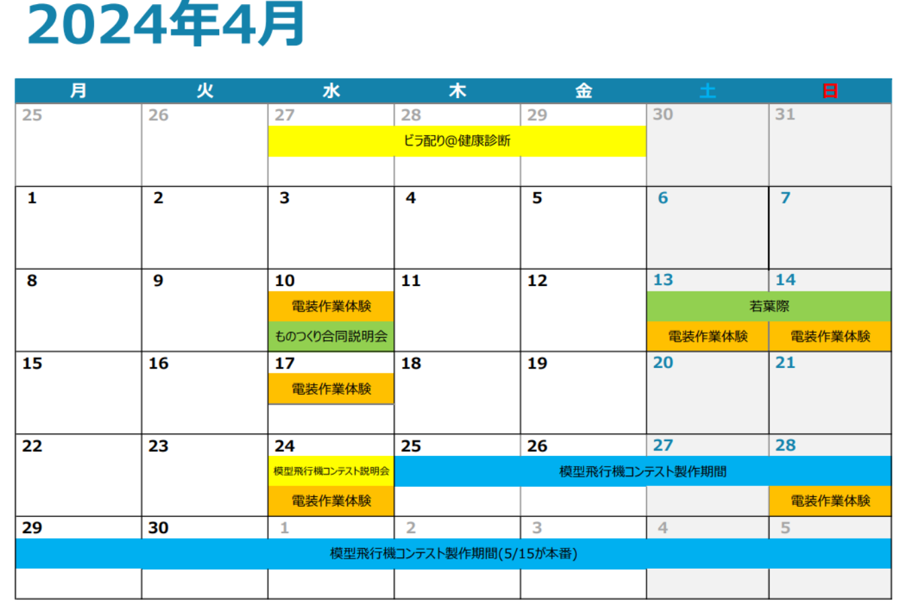

# 作業体験 特設サイト

## 作業体験の流れ

### 1. 申し込み

[応募フォーム](https://forms.gle/UWvmDFy2tdmvrmw7A)よりご応募ください。
質問等ありましたら[公式Twitter](https://twitter.com/meister_welcome)か[公式LINE](https://liff.line.me/1645278921-kWRPP32q/?accountId=722fzwlk),[公式Instagram](https://www.instagram.com/tokyotechmeister_pr/?hl=ja)までご連絡ください。

### 2. 部品を受け取る

この作業体験でははんだ付けを行いますが、家でやりたい方がいれば、事前に部品を受け取ることが可能です。

受け取る際は、事前に[公式Twitter](https://twitter.com/meister_welcome)か[公式LINE](https://liff.line.me/1645278921-kWRPP32q/?accountId=722fzwlk),[公式Instagram](https://www.instagram.com/tokyotechmeister_pr/?hl=ja)までご連絡ください。

なお、家で作業を進める予定がなかったり部品を無くさないか不安だったりする場合は、当日お渡しします。

### 3. 作業体験

申し込みの時に指定した時間にお越しください。作業時間目安は6時間前後で、途中退出可能です。途中退出を希望する方は気軽にお申し付けください。

## 日程

カレンダーに記載されている日程よりお選びください。どの日程でも内容は同じです。
これ以外の日程を希望される場合は、個別に対応するのでSNS等でご連絡ください。

## 持ち物

パソコンを持参してください。

万が一パソコンをご用意ができなくても、予備のパソコンを貸し出すことは可能です。ただし、台数が非常に限られていますので、可能な限りご持参ください。

## 資料（要編集)

当日に使う予定の資料です。分量が多いため、事前に目を通しておくことをお勧めします。

* [はじめに(ハードウェア編)](https://github.com/TitechMeister/Device-ATtiny2313_Board/tree/main/docs/day0.0)
* [はじめに(ソフトウェア編)](https://github.com/TitechMeister/Device-ATtiny2313_Board/tree/main/docs/day0.5)
* [第1回 LEDとボタン](https://github.com/TitechMeister/Device-ATtiny2313_Board/tree/main/docs/day1/)
* [第2回 7セグメントLED](https://github.com/TitechMeister/Device-ATtiny2313_Board/tree/main/docs/day2/)
* [第3回 ダイナミック点灯](https://github.com/TitechMeister/Device-ATtiny2313_Board/tree/main/docs/day3/)
* [第4回 タイマ割り込み](https://github.com/TitechMeister/Device-ATtiny2313_Board/tree/main/docs/day4/)
* [第5回 スロットマシン](https://github.com/TitechMeister/Device-ATtiny2313_Board/tree/main/docs/day5/)
